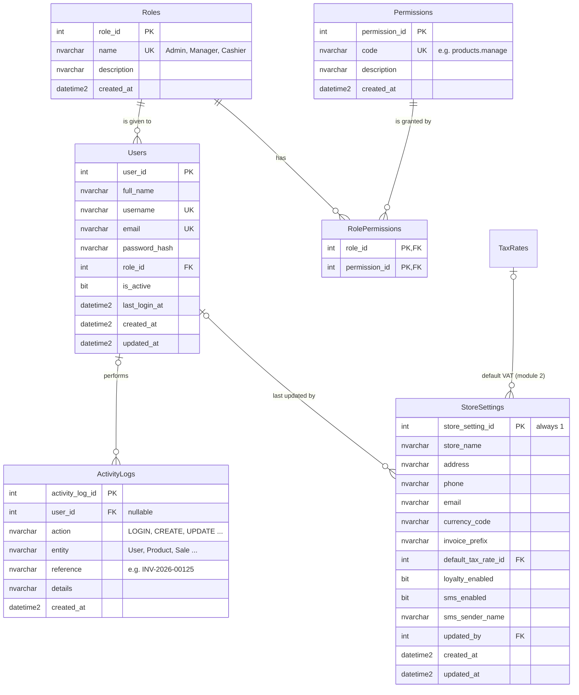

# Module 1 – Auth & Administration

**Owner:** @sidratul-m00ntaha · **PRD:** 5.1 Authentication, 5.2 Users & roles, 5.21 Activity log, 5.23 Store settings
AI Assistant tables (PRD 5.22) are added later, in Wave 4.

## Diagram



## Tables

### Roles

The three roles from PRD section 4.

| Column        | Type          | Rules                                            |
| ------------- | ------------- | ------------------------------------------------ |
| `role_id`     | INT           | PK, auto-numbered                                |
| `name`        | NVARCHAR(50)  | NOT NULL, UNIQUE – `Admin`, `Manager`, `Cashier` |
| `description` | NVARCHAR(255) |                                                  |
| `created_at`  | DATETIME2     | NOT NULL                                         |

### Permissions

One row per action that needs permission (see the list below).

| Column          | Type          | Rules                                     |
| --------------- | ------------- | ----------------------------------------- |
| `permission_id` | INT           | PK, auto-numbered                         |
| `code`          | NVARCHAR(100) | NOT NULL, UNIQUE – e.g. `products.manage` |
| `description`   | NVARCHAR(255) |                                           |
| `created_at`    | DATETIME2     | NOT NULL                                  |

### RolePermissions

Which role has which permission.

| Column          | Type | Rules                |
| --------------- | ---- | -------------------- |
| `role_id`       | INT  | PK, FK → Roles       |
| `permission_id` | INT  | PK, FK → Permissions |

### Users

Staff accounts. Customers are **not** users – they don't log in (PRD 5.11).

| Column          | Type          | Rules                                                   |
| --------------- | ------------- | ------------------------------------------------------- |
| `user_id`       | INT           | PK, auto-numbered                                       |
| `full_name`     | NVARCHAR(100) | NOT NULL                                                |
| `username`      | NVARCHAR(50)  | NOT NULL, UNIQUE                                        |
| `email`         | NVARCHAR(255) | NOT NULL, UNIQUE                                        |
| `password_hash` | NVARCHAR(255) | NOT NULL – a scrambled version, never the real password |
| `role_id`       | INT           | NOT NULL, FK → Roles                                    |
| `is_active`     | BIT           | NOT NULL, default 1 – inactive users can't log in       |
| `last_login_at` | DATETIME2     |                                                         |
| `created_at`    | DATETIME2     | NOT NULL                                                |
| `updated_at`    | DATETIME2     |                                                         |

### ActivityLogs

Important business actions only, not every click (PRD 5.21).

| Column            | Type          | Rules                                                                     |
| ----------------- | ------------- | ------------------------------------------------------------------------- |
| `activity_log_id` | INT           | PK, auto-numbered                                                         |
| `user_id`         | INT           | FK → Users; empty for actions done by the system                          |
| `action`          | NVARCHAR(50)  | NOT NULL – `LOGIN`, `CREATE`, `UPDATE`, `DELETE`, `PAYMENT`, `ADJUSTMENT` |
| `entity`          | NVARCHAR(50)  | NOT NULL – `User`, `Product`, `Purchase`, `Sale` …                        |
| `reference`       | NVARCHAR(100) | Which record, e.g. `INV-2026-00125` or `42`                               |
| `details`         | NVARCHAR(500) | Short description, e.g. `Role changed to Manager`                         |
| `created_at`      | DATETIME2     | NOT NULL – when it happened                                               |

Indexes on `created_at` and `user_id`, for filtering the log page.

### StoreSettings

Always exactly **one row** (`store_setting_id = 1`).

| Column                | Type          | Rules                                          |
| --------------------- | ------------- | ---------------------------------------------- |
| `store_setting_id`    | INT           | PK – always 1                                  |
| `store_name`          | NVARCHAR(150) | NOT NULL                                       |
| `address`             | NVARCHAR(255) |                                                |
| `phone`               | NVARCHAR(20)  |                                                |
| `email`               | NVARCHAR(255) |                                                |
| `currency_code`       | NVARCHAR(3)   | NOT NULL, default `BDT` – Bangladeshi Taka (৳) |
| `invoice_prefix`      | NVARCHAR(10)  | NOT NULL, default `INV`                        |
| `default_tax_rate_id` | INT           | FK → TaxRates (module 2)                       |
| `loyalty_enabled`     | BIT           | NOT NULL, default 1                            |
| `sms_enabled`         | BIT           | NOT NULL, default 0                            |
| `sms_sender_name`     | NVARCHAR(20)  | Name shown as the SMS sender                   |
| `updated_by`          | INT           | FK → Users                                     |
| `created_at`          | DATETIME2     | NOT NULL                                       |
| `updated_at`          | DATETIME2     |                                                |

> The SMS provider's **API key is not stored here**. It's a secret, so it goes in `backend/.env`.

## Roles and permissions

Based on PRD section 4. **Admin has every permission.** Any logged-in user can _view_ everyday lists such as products and customers (the POS needs them); permissions protect **changes** and **sensitive pages**.

| Permission code         | Allows                                       | Admin | Manager | Cashier |
| ----------------------- | -------------------------------------------- | :---: | :-----: | :-----: |
| `users.manage`          | Create, edit, deactivate users; assign roles |  ✅   |         |         |
| `settings.manage`       | Change store settings                        |  ✅   |         |         |
| `activity_logs.view`    | See the activity log                         |  ✅   |         |         |
| `tax_rates.manage`      | Create and change VAT rates                  |  ✅   |         |         |
| `products.view`         | View products, categories, brands, units     |  ✅   |   ✅    |   ✅    |
| `products.manage`       | Products, categories, brands, units          |  ✅   |   ✅    |         |
| `suppliers.manage`      | Suppliers                                    |  ✅   |   ✅    |         |
| `purchases.manage`      | Create purchases, pay supplier dues          |  ✅   |   ✅    |         |
| `inventory.manage`      | Stock adjustments and batches                |  ✅   |   ✅    |         |
| `customers.manage`      | View, edit, update credit limit, deactivate  |  ✅   |   ✅    |         |
| `customers.create`      | Register a new customer (POS at checkout)    |  ✅   |   ✅    |   ✅    |
| `customer_dues.receive` | Receive customer due payments                |  ✅   |   ✅    |         |
| `loyalty.configure`     | Loyalty tiers                                |  ✅   |   ✅    |         |
| `pos.sell`              | Use the POS: sales, invoices, invoice SMS    |  ✅   |   ✅    |   ✅    |
| `sales.view`            | Sales history and invoices                   |  ✅   |   ✅    |         |
| `reports.view`          | Dashboard, reports, expiry alerts            |  ✅   |   ✅    |         |
| `ai.use`                | AI Assistant                                 |  ✅   |   ✅    |         |

Need a new permission for your module? Add it to `backend/app/core/permissions.py` **and** to this table in a PR, and request a review from the Module 1 owner. Then run `python -m app.init_db` to add it to your database.

## What Module 1 gives other modules

Ready to use – import them in your router:

```python
from app.core.dependencies import get_current_user, require_permission
from app.models import User
from app.services.activity_log_service import log_activity
from app.services.store_setting_service import get_store_settings
```

| Function | What it gives you | If it fails |
|---|---|---|
| `Depends(get_current_user)` | The logged-in `User` | **401** – not logged in, token expired (after 8 hours) or account deactivated |
| `Depends(require_permission("code"))` | The logged-in `User`, **if their role has that permission** | **401** as above, or **403** – logged in but not allowed |
| `log_activity(db, user_id, action, entity, reference=None, details=None)` | Adds an ActivityLogs row. It does **not** commit – your `db.commit()` saves it together with your own changes | – |
| `get_store_settings(db)` | The `StoreSetting` row: `store_name`, `address`, `phone`, `email`, `currency_code`, `invoice_prefix`, `default_tax_rate_id`, `loyalty_enabled`, `sms_enabled`, `sms_sender_name` – e.g. for invoices (Module 5) or loyalty (Module 6) | **500** – the row is missing; run `python -m app.init_db` |

**Writing good log rows:** admins read them on the **Activity Logs** page, where they can filter by user, action, record type (`entity`) and date, and search the `reference` and `details`. So use the action names from the ActivityLogs table above, your model's class name for `entity` (`Product`, `Purchase`), the record's code or number for `reference` (`INV-2026-00125`) and a short readable sentence for `details`.

**Store settings in the frontend:** `getStoreSettings()` from `src/services/store-settings.service.ts` works for every logged-in user (`GET /api/settings`). It also gives `currency_symbol` (e.g. `৳`) for showing money. Only admins can change the settings (`PUT /api/settings`, `settings.manage`).

**Module 2:** `default_tax_rate_id` isn't editable yet. When the TaxRates table exists, add its foreign key here and a "Default VAT rate" choice to the Tax / VAT card on the Store settings page (`frontend/src/modules/settings/StoreSettingsPage.tsx`).

**Which one to use:** viewing everyday lists (products, customers) → `get_current_user`. Changing data or opening sensitive pages → `require_permission`. Use the codes from the table above; a misspelled code stops the backend from starting, with a message telling you so.

Example (how Module 2 would write its products router):

```python
from fastapi import APIRouter, Depends
from sqlalchemy.orm import Session

from app.core.dependencies import get_current_user, require_permission
from app.database import get_db
from app.models import Product, User
from app.schemas.product import ProductCreate
from app.services.activity_log_service import log_activity

router = APIRouter(prefix="/api/products", tags=["Products"])


@router.get("")
def list_products(db: Session = Depends(get_db), current_user: User = Depends(get_current_user)):
    ...  # any logged-in user may view products


@router.post("")
def create_product(
    data: ProductCreate,
    db: Session = Depends(get_db),
    current_user: User = Depends(require_permission("products.manage")),
):
    product = Product(**data.model_dump())
    db.add(product)
    db.flush()  # the database gives the product its product_id
    log_activity(db, current_user.user_id, "CREATE", "Product", reference=str(product.product_id))
    db.commit()  # saves the product and the log row together
    return product
```

**Testing:** on the Swagger page (http://127.0.0.1:8000/docs) click **Authorize** and log in, then call your endpoint. **401** = not logged in, **403** = your role isn't allowed.

Until Module 1 is merged into `main`, build your endpoints **without** the `get_current_user` / `require_permission` lines and add them afterwards – it's a one-line change per endpoint.

## Team decisions

- [x] **Managers can use the POS** – yes (`pos.sell` is given to Admin, Manager and Cashier)
- [x] **Currency:** Bangladeshi Taka – `currency_code = BDT`, shown as ৳
- [x] **SMS settings:** `sms_enabled` and `sms_sender_name` are enough; the SMS provider's API key goes in `backend/.env`
- [ ] **Loyalty earning rule** (e.g. 1 point per 100 ৳ spent): store it in Module 6's tables or in StoreSettings? – being decided with Module 6

## Later (Wave 4): AI Assistant tables

- `AIConversations` – one chat session per user
- `AIMessages` – each question and answer, including **which report function** produced the answer (PRD 5.22 requires answers to be traceable)
