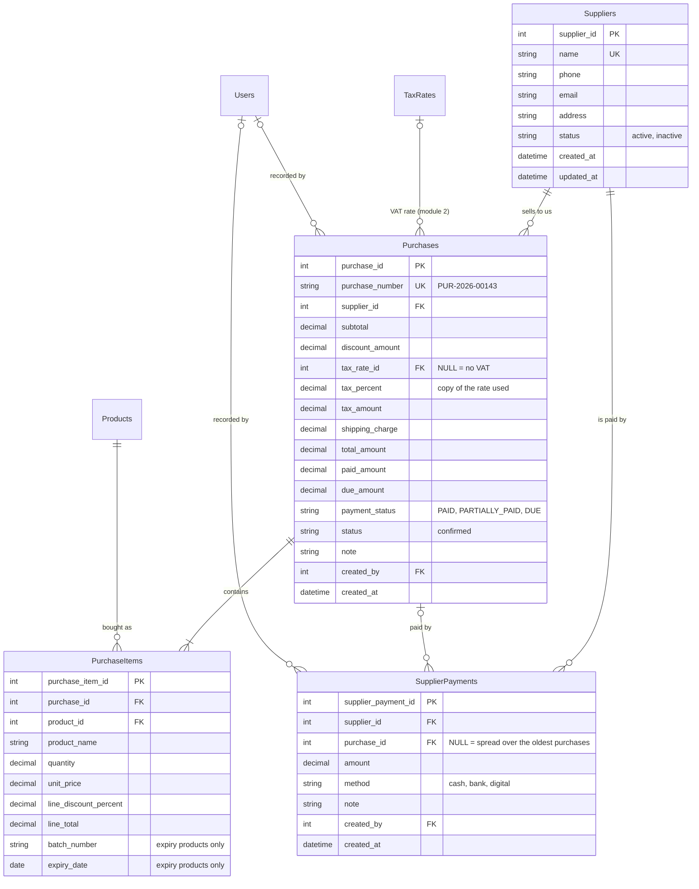

# Module 3: Suppliers & Purchasing

PRD sections 5.5, 5.6, 5.7. This module records who the store buys from, what was delivered (which raises stock), what was paid, and what is still owed to each supplier.

## Tables

- **Suppliers**: one row per supplier, active or inactive. Suppliers are deactivated, never deleted, so history stays intact.
- **Purchases**: one row per confirmed purchase, with the totals, the paid / due amounts and the payment status.
- **PurchaseItems**: the lines of a purchase. Product name, price and discount are copied per line, so a purchase never changes later.
- **SupplierPayments**: every payment made to a supplier, including the one made when the purchase was recorded.

## Entity relationship diagram

## Notes

- **Calculation (PRD 5.6):** `line_total = quantity x unit_price x (1 - line discount %)`, `subtotal = sum of the lines`, `tax = subtotal x tax %`, `total = subtotal - discount + tax + shipping`, `due = total - paid`. Each amount is rounded once (half up). The code is in `services/purchase_calculator.py` (Decimal only, no `float`). The browser only shows a preview: the server recalculates everything.
- **VAT is charged on the subtotal**, as PRD 5.6 writes it. Sales (Module 5) charge it after the discount. If the team wants purchases to match, change `taxable` in `calculate_purchase`. Nothing else changes.
- **A supplier's balance is never stored.** `total purchases = sum(total_amount)`, `total paid = sum(paid_amount)` and `outstanding due = sum(due_amount)` over the supplier's purchases (`supplier_service.supplier_totals`). It cannot drift out of sync.
- **Purchase number:** `PUR-<year>-<purchase_id, 5 digits>`. The id is generated by the database, so two managers can never get the same number. A rolled-back purchase leaves a gap in the numbers.
- **Prices come from the manager, quantities are whole numbers.** Stock is counted in whole units, so a fractional quantity is refused.
- **Only active suppliers and active products can be purchased** (PRD 5.3, 5.5). An inactive supplier can still be paid.
- **VAT rate:** the purchase stores `tax_rate_id` and a copy of the percent (`tax_percent`), so changing the rate in Settings never changes old purchases.

## Payments (PRD 5.7)

- A payment made **when the purchase is recorded** is saved as a `SupplierPayments` row with `purchase_id` set.
- A payment made **later** either names one purchase (`purchase_id` set) or is spread over the supplier's **oldest open purchases first** (`purchase_id` empty).
- Either way the purchases' `paid_amount` / `due_amount` / `payment_status` are updated, so `sum(SupplierPayments.amount) = sum(Purchases.paid_amount)` always holds (checked by a test).
- A payment can never be more than what is due, and it lowers the supplier's outstanding due by exactly its amount.

## Confirm-purchase transaction (single commit)

1. Validate the supplier (exists, active), the products (exist, active, whole quantity) and the VAT rate (active).
2. Products with expiry tracking must have a batch number and a future expiry date.
3. Calculate with `purchase_calculator.calculate_purchase` and check the payment with `settle_payment`.
4. Insert the purchase, `flush` (the database gives it its id), then set `purchase_number`.
5. Insert the lines. For each line call `stock_service.stock_in(..., source="purchase", reference_id=purchase_id)`. It raises stock, keeps `Products.current_quantity` in step and writes the stock movement.
6. For expiry products also insert the `StockBatches` row. This is done directly, **not** through `add_batch`, which would add the stock a second time.
7. If something was paid, insert the `SupplierPayments` row.
8. `log_activity(... "CREATE", "Purchase" ...)`, then the router does one `db.commit()`. Any error: nothing is saved.

## API

| Endpoint | Permission | What it does |
|---|---|---|
| `GET /api/suppliers` | `suppliers.manage` | List with totals. Optional `search`, `status_filter` |
| `POST /api/suppliers` | `suppliers.manage` | Add a supplier |
| `PUT /api/suppliers/{id}` | `suppliers.manage` | Edit, or activate / deactivate with `status` |
| `GET /api/purchases` | `purchases.manage` | History, newest first. Optional `search`, `supplier_id`, `payment_status` |
| `GET /api/purchases/{id}` | `purchases.manage` | One purchase with its lines |
| `POST /api/purchases` | `purchases.manage` | Confirm a purchase (adds stock) |
| `GET /api/supplier-payments` | `purchases.manage` | Payment history. Optional `search`, `supplier_id` |
| `POST /api/supplier-payments` | `purchases.manage` | Pay a supplier |

## What Module 3 needs from other modules

- **Module 1:** `require_permission`, `log_activity`, and `TaxRates` / `StoreSettings.default_tax_rate_id` (the new purchase page starts from the store's default VAT rate when one is set).
- **Module 2:** `Products` (the new purchase page lists active products and their `purchase_price`) and `TaxRates`.
- **Module 4:** `stock_service.stock_in`, and the `StockBatches` table.

## What other modules read from Module 3

- **AI Assistant** (`services/ai/report_functions.py`): `supplier_dues` and `purchases_summary` read `Purchases` and `Suppliers`.
- **Reports / Dashboard** (`services/report_service.py`): the purchase report and the dashboard's supplier due card can read the same tables.