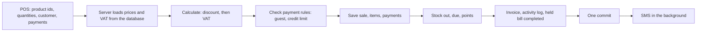

# Module 5: POS, Sales & Invoices

Documentation for the whole module: what it does, how it works, how it connects to the other modules, how to run and test it, and what is still open. The database tables and the diagram are in [`docs/database/module-5-sales.md`](database/module-5-sales.md); this page does not repeat them.

- **PRD sections:** 5.9 (barcode scanning), 5.14 (POS / sales), 5.15 (payments), 5.17 (invoices), 5.18 (SMS invoice notification).
- **Team extensions, not in the PRD:** held bills (hold and resume) and returns (cancelling items after the invoice).
- **Backend:** routers `sales`, `invoices`, `held_carts`, `sale_returns`, with matching `services/`, `models/` and `schemas/`.
- **Frontend:** `frontend/src/modules/pos/` and `frontend/src/modules/sales/`, with `services/pos.service.ts` and `services/sales.service.ts`.

## 1. What the module does

| Area | What a user can do |
|---|---|
| **POS screen** | Search products or scan a barcode / SKU, build a cart, change quantities, pick a customer (or sell to a guest), take payment, and complete the sale. The cart stays on screen and scrolls as one area, with the Total and the Hold / Complete sale buttons pinned at the bottom. |
| **Loyalty discount** | A registered customer's tier discount is applied automatically, before VAT. |
| **Payment** | Cash, card and digital, alone or mixed. A registered customer can pay part or nothing and leave the rest on due, within the credit limit. A guest must pay in full. |
| **Held bills** | Put a bill on hold to serve the next customer, resume it later (prices, VAT and stock are checked again), hold it again, or discard it. |
| **Invoices** | Every completed sale produces exactly one invoice with a unique number. It can be viewed and printed from the POS receipt, the Sales page and the Invoices page. |
| **Sales and Invoices pages** | Lists with date presets, payment-status filter, search (invoice number, customer name or phone), paging, and summary cards. They show each invoice's current paid and due. |
| **Returns** | Cancel some or all items of a sale after the invoice. Stock goes back (unless the goods are damaged), the customer's due is reduced or the money is refunded, and loyalty points are reversed. |
| **SMS** | After a sale, an SMS with the invoice number and total is sent when the store has SMS enabled and the customer has a phone number. It never blocks or undoes a sale. |
| **Demo data** | `python -m app.seed_demo` fills a local database with customers, sales, due payments, returns and a held bill. |

## 2. How it connects to the other modules

| Module | What Module 5 uses from it |
|---|---|
| **1: Auth & Administration** | Login and the permissions `pos.sell`, `sales.view` and `sales.return`; `log_activity` for the activity log; the store settings (store name, address, phone, invoice prefix, SMS enabled). |
| **2: Product Catalog** | Products, and their tax rates (`get_sellable_product` in `services/sale_dependencies.py`). Only active products can be sold. Module 2's dashboard and reports read the sales data. |
| **4: Inventory** | `stock_out` when a sale is completed and `stock_in` for a restocked return; available stock is Module 4's stock row when it exists, otherwise the product's own quantity. |
| **6: Customers** | Customers, credit limit and outstanding due; `add_due` and `add_points` (tier upgrade included); the loyalty status (tier name and discount %). Module 5 only reads `CustomerPayments`, to show the current due per invoice. |

Functions called from other modules (`stock_out`, `add_due`, `add_points`, `log_activity`) never call `commit()`. Module 5 commits once at the end of a sale, or rolls everything back.

## 3. Main flows

### 3.1 Completing a sale



The browser sends only product ids and quantities, the customer and the payments. Prices, VAT, discount, stock, due and points are all worked out by the server (`services/sale_service.py`); the totals shown on the POS screen are a live preview only. If any step fails, the whole sale is rolled back: no sale, no stock change, no due, no points, no invoice.

### 3.2 Hold and resume

Only the product and quantity are saved. Stock is not reserved. On resume, the server checks every line against today's products and stock, and the screen tells the cashier which lines were reduced or removed. The bill stays on hold until the sale is completed; the held bill and the sale are completed in the same transaction.

### 3.3 Returns

A return is a separate credit note (`SaleReturns` / `SaleReturnItems`); the original sale, items, payments and invoice are never edited, only `Sales.status` changes (`partially_returned` or `returned`). The refund first reduces the customer's due; the rest is refunded by the chosen method. Returned lines go back into stock unless marked as not restocked. Loyalty points are reversed in proportion to the refund, never below zero.

### 3.4 Current paid and due on the Sales list

A later due payment (Module 6) never edits a saved sale, so the list works out the current values when it loads. Payments and the due cleared by returns are applied to the customer's credit sales, **oldest first**. The invoice dialog and the printout keep showing the sale as it was at the time of sale. Details are in the database doc.

## 4. Business rules

| Rule | PRD |
|---|---|
| The loyalty discount is applied to the cart first, then VAT is calculated on the discounted amount. Each line is rounded once (half up), and sale totals are the sums of the lines. | 5.14 |
| A sale needs at least one valid line. Quantities are whole numbers for now. | 5.14 |
| A guest customer must pay the full amount. | 5.12 |
| A due that would go over the customer's available credit is rejected ("Credit limit exceeded"). | 5.12 |
| Paid + Due = Total. The status is `PAID` when due is 0, `DUE` when nothing was paid, otherwise `PARTIALLY_PAID`. | 5.15 |
| Loyalty points: 1 point per 100 actually paid (confirmed by Module 6), never for the due part, and only after the sale succeeds. | 5.13 |
| An inactive product cannot be sold. Not enough stock rolls back the whole sale. | 5.3, 5.8 |
| One invoice per sale, numbered `<prefix>-<year>-<sale id, 5 digits>` (for example `INV-2026-00125`). The prefix is a store setting. A rolled-back sale leaves a gap in the numbers. | 5.17 |
| The SMS is only attempted when SMS is enabled in the store settings and the customer has a phone number. A failed SMS never reverses a sale. | 5.18 |
| A scanned barcode (or SKU) finds the product, checks stock and shows a clear message; an unknown code falls back to the product search. | 5.9 |
| Money is always `Decimal` on the server, never `float`. | Team rule |

## 5. Permissions and API

| Endpoint | Permission | What it does |
|---|---|---|
| `POST /api/sales` | `pos.sell` | Completes a sale and returns the invoice. |
| `GET /api/sales` | `sales.view` | Sales list with filters, paging and sums (current paid and due). |
| `GET /api/sales/{sale_id}` | `sales.view` | One sale as an invoice document. |
| `POST /api/sales/{sale_id}/returns` | `sales.return` | Returns items from a sale. |
| `POST /api/held-carts` | `pos.sell` | Holds the current bill. |
| `GET /api/held-carts` | `pos.sell` | Lists the held bills. |
| `GET /api/held-carts/{held_cart_id}` | `pos.sell` | Loads a held bill with today's prices, VAT and stock. |
| `PUT /api/held-carts/{held_cart_id}` | `pos.sell` | Saves changes to a held bill. |
| `DELETE /api/held-carts/{held_cart_id}` | `pos.sell` | Discards a held bill. |
| `GET /api/invoices` | `sales.view` | Same rows as the sales list. |
| `GET /api/invoices/{invoice_number}` | `sales.view` | One invoice, for viewing or printing. |

There is no `/api/payments` endpoint: payments are only created inside `POST /api/sales` and come back with every sale and invoice.

## 6. Code map

| Area | Files |
|---|---|
| Backend routers | `routers/sales.py`, `invoices.py`, `held_carts.py`, `sale_returns.py` |
| Backend services | `sale_service.py` (the transaction), `sale_calculator.py` (amounts and payment rules), `sale_dependencies.py` (prices, VAT, stock), `invoice_service.py` (invoice number, invoice document, lists, current due), `held_cart_service.py`, `sale_return_service.py`, `notification_service.py` (SMS) |
| Models and schemas | `models/sale.py`, `models/sale_return.py`, `schemas/sale.py`, `schemas/held_cart.py`, `schemas/sale_return.py` |
| POS screen | `modules/pos/`: `PosPage`, `CustomerPanel`, `PaymentPanel`, `HeldBills`, `Receipt`, `posMath.ts` (live preview, whole paisa), `posProducts.ts`, `usePosProducts.ts` |
| Sales pages | `modules/sales/`: `SalesPage`, `InvoicesPage`, `SalesList`, `InvoiceDocument`, `InvoiceModal`, `InvoiceDialog`, `ReturnDialog`, `datePresets.ts` |
| Seed | `backend/app/seed_demo.py` |

## 7. Running it and the demo data

From the backend folder, with the virtual environment active:

```bat
docker compose up -d
python -m app.init_db
python -m app.seed_products
python -m app.seed_demo
uvicorn app.main:app --reload
```

From the frontend folder: `npm run dev`. Log in as `admin` with `FIRST_ADMIN_PASSWORD` from `backend/.env`.

`seed_demo` creates 4 customers, 13 sales over the last two weeks (two of them today), 3 due payments, 2 returns and 1 held bill, using the real `complete_sale` and `create_return`. It is safe to run again (it does nothing if the demo customers exist). To start clean: `python -m app.init_db --reset`, then `seed_products` and `seed_demo` again. `--reset` deletes all local data.

If the SMS stand-in should show in the log, start the backend with logging at INFO level; the stand-in only writes to the log.

## 8. Tests

From the backend folder:

```bat
python -m unittest discover -s tests -t .
```

| File | What it covers |
|---|---|
| `test_sale_calculator.py` | Line and sale amounts (discount before VAT, rounding half up, no floats, totals are the sum of the lines) and the payment rules (paid, due and status, guest, credit limit, overpayment). |
| `test_complete_sale.py` | The sale transaction: guest and customer sales, duplicate lines, loyalty discount, partial and due payments, credit limit, stock failures, resumed bills; each failure saves nothing. |
| `test_sale_returns.py` | Full and partial returns, proration, restock, refund against the due, points reversal, failed returns. |
| `test_held_carts.py` | Hold (only product and quantity, duplicates merged, bad carts rejected, stock untouched), the list, resume (prices and stock re-checked, a missing product shown, the bill stays on hold), update, discard, and a completed sale taking the bill off hold. |
| `test_invoices.py` | The invoice document (store, cashier and customer details, number from the store prefix, the same by number or by id, 404) and the sales list (newest first, sums over every match, paging, filters by payment status, date range with time zones, search and customer). |
| `test_live_due.py`, `test_live_due_flow.py` | Oldest-first allocation, and the flow buy on due, pay twice, return an item. |
| `test_sms_setting.py` | The SMS follows the store setting, needs a phone number, and never raises. |
| `test_product_foreign_key.py` | `product_id` is a real foreign key (checked with SQLite's foreign keys on). |

The tests use a throwaway in-memory database, never the Docker one. The frontend is checked with `npm run lint` and `npm run build`; it has no automated tests.

## 9. Design decisions

- **A sale is a snapshot.** The saved totals, paid, due and status of a sale are never edited after it is completed. Later due payments and returns are recorded separately, and the Sales list computes the current values from them. The invoice always shows the sale as it was.
- **"Oldest first" is our own rule.** `CustomerPayments` has no link to an invoice, so a due payment is applied to the customer's oldest unpaid sales first. A payment for an opening balance, or one made before the customer's first credit sale, can end up applied to a later sale.
- **One transaction, one commit.** Everything in a sale is saved together or not at all (PRD 5.14).
- **The server is authoritative.** The POS preview is for the cashier only; the server recalculates everything.
- **Returns are a credit note**, not an edit, so the invoice stays a financial record.
- **No separate payments endpoint** (see section 5).

## 10. Known limitations and open items

- **SMS provider.** The team has not chosen one, so the SMS only writes to the log. Replacing the body of `send_sms` in `notification_service.py` is the only change needed.
- **Inactive products on the POS.** Only active products are loaded on the POS screen, so a scanned inactive product shows the same message as an unknown code. The server still refuses it.
- **Held bills do not reserve stock.** Stock is checked again on resume.
- **The Sales list is paged in Python.** The current status cannot be filtered in plain SQL, so every matching sale is loaded first. This is fine at this size.
- **Returns and held bills are not in the PRD.** They are team extensions.
- **No frontend tests.** The frontend is checked by lint and build, and by hand.

## 11. Changes after the first release

| PR | Change |
|---|---|
| #40 | Returns (cancel items after the invoice). |
| #41 | `product_id` in `SaleItems` and `HeldCartItems` became a real foreign key (needs `init_db --reset`). |
| #45, #46 | The Sales list shows the current paid and due per invoice, and the flow test. |
| #47, #51 | Database documentation for the current due, returns, SMS, scanning and payments. |
| #49 | The SMS follows the store's SMS setting. |
| #50 | An unknown scanned barcode falls back to the product search. |
| #52 | Demo data seed. |
| #53, #54 | The POS cart stays on screen as one scroll area, with the Total and the buttons pinned. |
