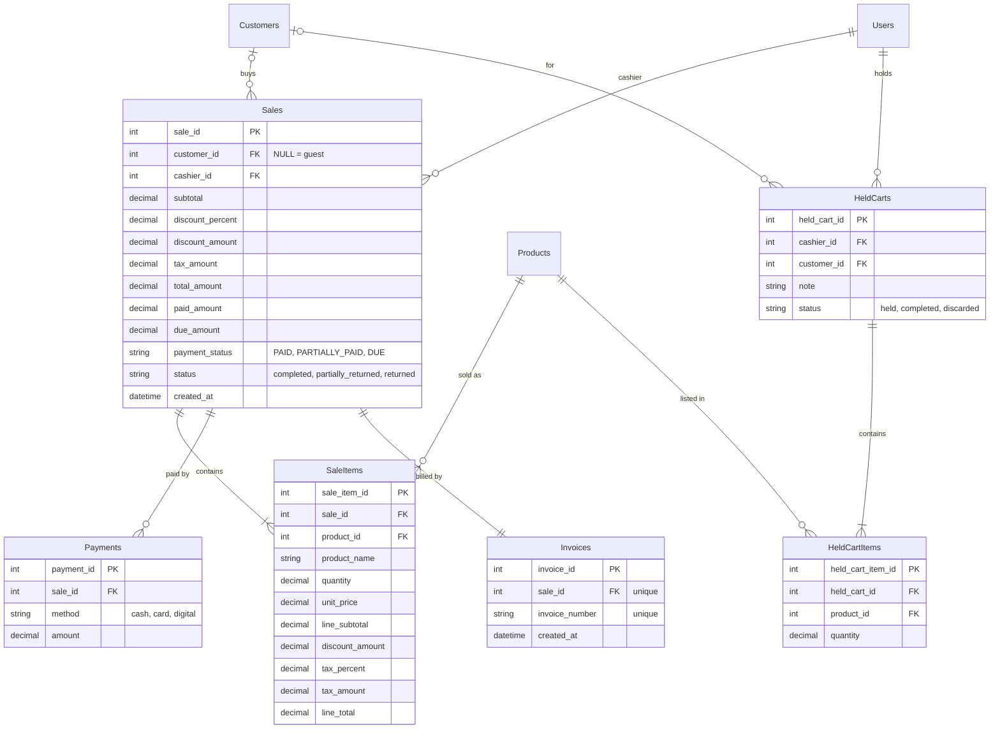

# Module 5: POS, Sales & Invoices

PRD sections 5.9, 5.14, 5.15, 5.17, 5.18. This module turns a cart into a sale, its payments and an invoice, lets a cashier pause a bill (held cart), and provides the Sales and Invoices pages.

## Tables

- **Sales**: one row per completed sale, with the totals, paid / due amounts and payment status.
- **SaleItems**: the lines of a sale. Prices, VAT and discount are stored per line, so invoices never change later.
- **Payments**: money actually received (cash / card / digital). A due amount is not a payment row.
- **Invoices**: exactly one per sale, with a unique invoice number.
- **HeldCarts / HeldCartItems**: a paused bill. Not a sale: no stock, points, due or invoice is touched.

## Entity relationship diagram

## Notes

- **Calculation order (PRD 5.14):** `line_subtotal = unit_price x quantity`, then the loyalty discount, then VAT on the discounted amount. Each line is rounded once (half up). Sale totals are the sums of the lines, so the sale, its items and the invoice always match. The code is in `services/sale_calculator.py` (Decimal only, no `float`).
- **Prices come from the database, never from the browser.** The POS sends only `product_id` and `quantity`; the price and VAT come from `get_sellable_product` in `services/sale_dependencies.py`, which reads Module 2's `Products` and its `TaxRates` (falling back to the product's own `tax_percent` when it has no tax rate).
- **Available stock** (`get_available_quantity` in the same file) is Module 4's `ProductStock.current_stock` when that row exists, otherwise `Products.current_quantity` — the same rule `stock_out` uses, so the two never disagree.
- **Guest sale:** `customer_id` is NULL and the sale must be paid in full (PRD 5.12).
- **Paid + Due = Total (PRD 5.15).** `paid_amount` is the sum of the `Payments` rows; `due_amount = total_amount - paid_amount`. `payment_status` is `PAID` when due is 0, `DUE` when nothing was paid, otherwise `PARTIALLY_PAID`. Repaying a due later is recorded by Module 6 in `CustomerPayments`, not in `Payments`.
- **Invoice number (PRD 5.17):** `<prefix>-<year>-<sale_id, 5 digits>`, e.g. `INV-2026-00125`. The prefix is the store's **invoice prefix** setting (Module 1, `StoreSettings.invoice_prefix`, default `INV`), so it can be changed without a code change. `sale_id` is unique and generated by the database, so two cashiers can never get the same number. A rolled-back sale leaves a gap in the numbers.
- **Invoice document.** `SaleOut` (`schemas/sale.py`) carries the header details alongside the sale: the store's name, address and phone (read fresh from `StoreSettings` each time, so a reprint shows the store's current details), the cashier's name, and the customer's name and phone (both `None` for a guest). `services/invoice_service.py` builds this from a `Sale` row plus its items and payments; `to_sale_out` is used both when a sale is completed and when an invoice is looked up later, so the two are always identical.
- **`Sales.status`** is `completed` for now. `partially_returned` and `returned` are used by the planned return feature.
- **Held carts** save only product and quantity. On resume, prices, VAT, discount and stock are re-checked against the current data. Stock is not reserved while a cart is held. A held cart becomes `completed` in the same transaction that completes its sale (`held_cart_id` on the sale request).
- **`product_id`** in `SaleItems` and `HeldCartItems` is still a plain INT, not a foreign key. Module 2's `Products` table now exists on `main`, and Module 3 and Module 4 have already tightened their own product columns to `ForeignKey("Products.product_id")`, so ours should follow in a small follow-up PR.
- Module 6 has a foreign key from `LoyaltyTransactions.sale_id` to `Sales.sale_id`, and `add_points` records each sale's points there (`sale_id`, `description`) so they show up in the loyalty history.

## Complete-sale transaction (single commit)

1. Validate the cart, the products (active) and the customer.
2. Load prices and VAT from the database; calculate with `sale_calculator.calculate_sale`.
3. Check payments with `sale_calculator.settle_payment` (guest rule, credit limit).
4. Insert the sale, `flush`, then the items and payments.
5. `stock_out(...)` for each line (Module 4). Not enough stock: roll back.
6. Apply the customer's due, points (with the sale's id and invoice number) and tier (Module 6).
7. Build the invoice number from the store's prefix, create the invoice, and mark the held cart `completed` (if the bill was resumed).
8. `log_activity(...)`, then one `db.commit()`. Any error: `db.rollback()`.
9. After the commit only: send the SMS (`services/notification_service.py`, a stand-in that logs until a provider is chosen — PRD 5.18). A failure is logged and never undoes the sale.

## API endpoints

| Endpoint | Permission | What it does |
|---|---|---|
| `POST /api/sales` | `pos.sell` | Completes a sale (the transaction above) and returns the invoice. |
| `GET /api/sales` | `sales.view` | Sales, newest first, with date range / payment status / customer / text filters, paging, and sums over every match — the Sales page. |
| `GET /api/sales/{sale_id}` | `sales.view` | One sale as an invoice document. |
| `POST /api/held-carts` | `pos.sell` | Puts the current bill on hold. |
| `GET /api/held-carts` | `pos.sell` | Every bill on hold, newest first; any cashier can resume any of them. |
| `GET /api/held-carts/{held_cart_id}` | `pos.sell` | Loads a held bill with today's prices, VAT and stock (each line flags a problem, e.g. "Only 2 in stock."); does not take it off hold. |
| `PUT /api/held-carts/{held_cart_id}` | `pos.sell` | Saves changes to a held bill (used by "Hold again") instead of creating a duplicate. |
| `DELETE /api/held-carts/{held_cart_id}` | `pos.sell` | Discards a held bill (the row is kept with status `discarded`). |
| `GET /api/invoices` | `sales.view` | Same rows as `GET /api/sales` — the Invoices page. |
| `GET /api/invoices/{invoice_number}` | `sales.view` | One invoice, looked up by its number, for viewing or printing. |

## Frontend

- `modules/pos/`: the POS screen (product search/scan, cart, `CustomerPanel`, `PaymentPanel`, `HeldBills`, `Receipt`), plus `posMath.ts` (the same Decimal-free maths as the server, in whole paisa, for a live preview only — the server recalculates and is authoritative).
- `modules/sales/`: `SalesPage` and `InvoicesPage` (both built on the shared `SalesList`, with date presets, filters, search and paging), and the shared invoice pieces `InvoiceDocument` / `InvoiceModal` / `InvoiceDialog` used by both the POS receipt and a reprint from these pages, so the two can never drift apart.
- `services/pos.service.ts` and `services/sales.service.ts` wrap the endpoints above.

## Planned (not built yet)

- **SaleReturns / SaleReturnItems** for cancelling an item after the invoice: restock (`stock_in`), refund or reduce the due, reverse points, and print a return receipt. The original invoice is never edited.
