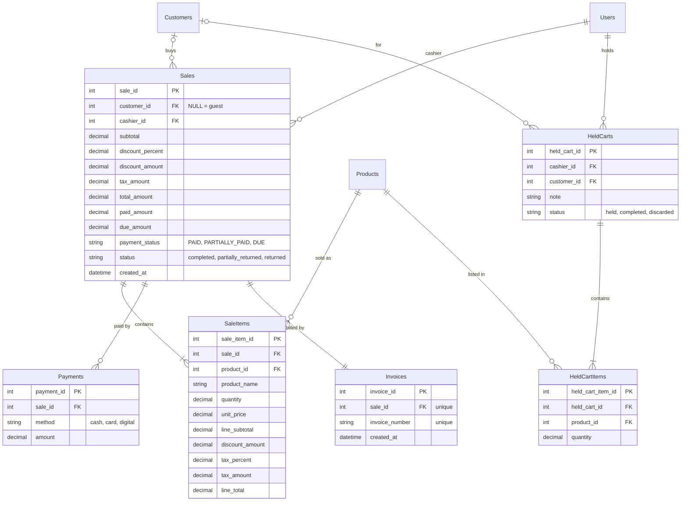

# Module 5: POS, Sales & Invoices

PRD sections 5.9, 5.14, 5.15, 5.17, 5.18. This module turns a cart into a sale, its payments and an invoice, and lets a cashier pause a bill (held cart).

## Tables

- **Sales**: one row per completed sale, with the totals, paid / due amounts and payment status.
- **SaleItems**: the lines of a sale. Prices, VAT and discount are stored per line, so invoices never change later.
- **Payments**: money actually received (cash / card / digital). A due amount is not a payment row.
- **Invoices**: exactly one per sale, with a unique invoice number.
- **HeldCarts / HeldCartItems**: a paused bill. Not a sale: no stock, points, due or invoice is touched.

## Entity relationship diagram

## Notes

- **Calculation order (PRD 5.14):** `line_subtotal = unit_price x quantity`, then the loyalty discount, then VAT on the discounted amount. Each line is rounded once (half up). Sale totals are the sums of the lines, so the sale, its items and the invoice always match. The code is in `services/sale_calculator.py` (Decimal only, no `float`).
- **Prices come from the database, never from the browser.** The POS sends only `product_id` and `quantity`.
- **Guest sale:** `customer_id` is NULL and the sale must be paid in full (PRD 5.12).
- **Paid + Due = Total (PRD 5.15).** `paid_amount` is the sum of the `Payments` rows; `due_amount = total_amount - paid_amount`. `payment_status` is `PAID` when due is 0, `DUE` when nothing was paid, otherwise `PARTIALLY_PAID`. Repaying a due later is recorded by Module 6 in `CustomerPayments`, not in `Payments`.
- **Invoice number:** `INV-<year>-<sale_id, 5 digits>`, e.g. `INV-2026-00125`. `sale_id` is unique and generated by the database, so two cashiers can never get the same number. A rolled-back sale leaves a gap in the numbers.
- **`Sales.status`** is `completed` for now. `partially_returned` and `returned` are used by the planned return feature.
- **Held carts** save only product and quantity. On resume, prices, VAT, discount and stock are re-checked. Stock is not reserved while a cart is held. A held cart becomes `completed` in the same transaction that completes its sale.
- **`product_id`** in `SaleItems` and `HeldCartItems` is a plain INT until Module 2's `Products` model is merged. Then add `ForeignKey("Products.product_id")`.
- Module 6 should add a foreign key from `LoyaltyTransactions.sale_id` to `Sales.sale_id` once this model is merged.

## Complete-sale transaction (single commit)

1. Validate the cart, the products (active) and the customer.
2. Load prices and VAT from the database; calculate with `sale_calculator.calculate_sale`.
3. Check payments with `sale_calculator.settle_payment` (guest rule, credit limit).
4. Insert the sale, `flush`, then the items and payments.
5. `stock_out(...)` for each line (Module 4). Not enough stock: roll back.
6. Apply the customer's due, points and tier (Module 6).
7. Create the invoice and mark the held cart `completed` (if the bill was resumed).
8. `log_activity(...)`, then one `db.commit()`. Any error: `db.rollback()`.
9. After the commit only: send the SMS. A failure is logged and never undoes the sale.

## Planned (not built yet)

- **SaleReturns / SaleReturnItems** for cancelling an item after the invoice: restock (`stock_in`), refund or reduce the due, reverse points, and print a return receipt. The original invoice is never edited.
