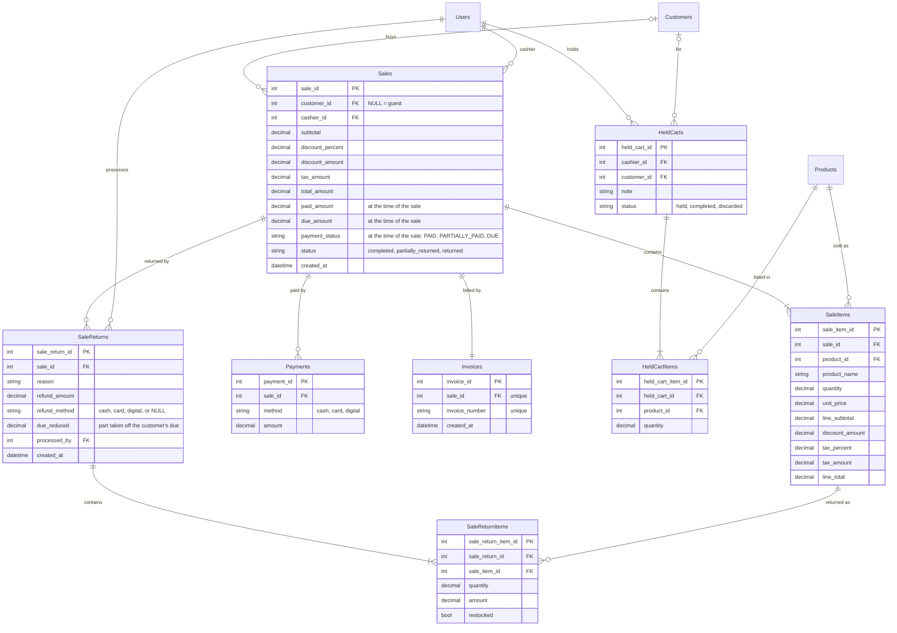

# Module 5: POS, Sales & Invoices

PRD sections 5.9, 5.14, 5.15, 5.17, 5.18. This module turns a cart into a sale, its payments and an invoice, lets a cashier pause a bill (held cart), cancel items after the invoice (returns), and provides the Sales and Invoices pages.

## Tables

- **Sales**: one row per completed sale, with the totals, paid / due amounts and payment status. The paid / due amounts and the payment status are saved **as they were at the moment of the sale** (see "Current paid and due on the Sales list").
- **SaleItems**: the lines of a sale. Prices, VAT and discount are stored per line, so invoices never change later.
- **Payments**: money actually received (cash / card / digital). A due amount is not a payment row.
- **Invoices**: exactly one per sale, with a unique invoice number.
- **HeldCarts / HeldCartItems**: a paused bill. Not a sale: no stock, points, due or invoice is touched.
- **SaleReturns / SaleReturnItems**: a return (credit note) against a sale, and its lines. The original sale, items, payments and invoice are never edited.

## Entity relationship diagram

```mermaid
erDiagram
    Customers |o--o{ Sales : "buys"
    Users ||--o{ Sales : "cashier"
    Sales ||--|{ SaleItems : "contains"
    Sales ||--o{ Payments : "paid by"
    Sales ||--|| Invoices : "billed by"
    Products ||--o{ SaleItems : "sold as"
    Users ||--o{ HeldCarts : "holds"
    Customers |o--o{ HeldCarts : "for"
    HeldCarts ||--|{ HeldCartItems : "contains"
    Products ||--o{ HeldCartItems : "listed in"
    Sales ||--o{ SaleReturns : "returned by"
    Users ||--o{ SaleReturns : "processes"
    SaleReturns ||--|{ SaleReturnItems : "contains"
    SaleItems ||--o{ SaleReturnItems : "returned as"

    Sales {
        int sale_id PK
        int customer_id FK "NULL = guest"
        int cashier_id FK
        decimal subtotal
        decimal discount_percent
        decimal discount_amount
        decimal tax_amount
        decimal total_amount
        decimal paid_amount "at the time of the sale"
        decimal due_amount "at the time of the sale"
        string payment_status "at the time of the sale: PAID, PARTIALLY_PAID, DUE"
        string status "completed, partially_returned, returned"
        datetime created_at
    }

    SaleItems {
        int sale_item_id PK
        int sale_id FK
        int product_id FK
        string product_name
        decimal quantity
        decimal unit_price
        decimal line_subtotal
        decimal discount_amount
        decimal tax_percent
        decimal tax_amount
        decimal line_total
    }

    Payments {
        int payment_id PK
        int sale_id FK
        string method "cash, card, digital"
        decimal amount
    }

    Invoices {
        int invoice_id PK
        int sale_id FK "unique"
        string invoice_number "unique"
        datetime created_at
    }

    HeldCarts {
        int held_cart_id PK
        int cashier_id FK
        int customer_id FK
        string note
        string status "held, completed, discarded"
    }

    HeldCartItems {
        int held_cart_item_id PK
        int held_cart_id FK
        int product_id FK
        decimal quantity
    }

    SaleReturns {
        int sale_return_id PK
        int sale_id FK
        string reason
        decimal refund_amount
        string refund_method "cash, card, digital, or NULL"
        decimal due_reduced "part taken off the customer's due"
        int processed_by FK
        datetime created_at
    }

    SaleReturnItems {
        int sale_return_item_id PK
        int sale_return_id FK
        int sale_item_id FK
        decimal quantity
        decimal amount
        bool restocked
    }
```

## Notes

- **Calculation order (PRD 5.14):** `line_subtotal = unit_price x quantity`, then the loyalty discount, then VAT on the discounted amount. Each line is rounded once (half up). Sale totals are the sums of the lines, so the sale, its items and the invoice always match. The code is in `services/sale_calculator.py` (Decimal only, no `float`).
- **Prices come from the database, never from the browser.** The POS sends only `product_id` and `quantity`; the price and VAT come from `get_sellable_product` in `services/sale_dependencies.py`, which reads Module 2's `Products` and its `TaxRates` (falling back to the product's own `tax_percent` when it has no tax rate).
- **Available stock** (`get_available_quantity` in the same file) is Module 4's `ProductStock.current_stock` when that row exists, otherwise `Products.current_quantity` — the same rule `stock_out` uses, so the two never disagree.
- **Guest sale:** `customer_id` is NULL and the sale must be paid in full (PRD 5.12).
- **Paid + Due = Total (PRD 5.15).** When the sale is saved, `paid_amount` is the sum of the `Payments` rows and `due_amount = total_amount - paid_amount`. `payment_status` is `PAID` when due is 0, `DUE` when nothing was paid, otherwise `PARTIALLY_PAID`. These three values are a snapshot: they are never edited afterwards. Repaying a due later is recorded by Module 6 in `CustomerPayments`, not in `Payments` and not on the sale. The Sales list works out the current values from it (next section).
- **There is no separate payments endpoint.** The PRD's API list names `/api/payments`, but a `Payments` row is only ever created inside `POST /api/sales`, in the same transaction as the sale, and it comes back in the `payments` list of every sale and invoice. No screen needs to list payments on their own, and Module 2's reports can read the `Payments` table directly (for example the payment-method breakdown). If a screen ever needs one, a read-only `GET /api/payments` is easy to add; it must not create or edit payments.
- **Invoice number (PRD 5.17):** `<prefix>-<year>-<sale_id, 5 digits>`, e.g. `INV-2026-00125`. The prefix is the store's **invoice prefix** setting (Module 1, `StoreSettings.invoice_prefix`, default `INV`), so it can be changed without a code change. `sale_id` is unique and generated by the database, so two cashiers can never get the same number. A rolled-back sale leaves a gap in the numbers.
- **Invoice document.** `SaleOut` (`schemas/sale.py`) carries the header details alongside the sale: the store's name, address and phone (read fresh from `StoreSettings` each time, so a reprint shows the store's current details), the cashier's name, and the customer's name and phone (both `None` for a guest). `services/invoice_service.py` builds this from a `Sale` row plus its items and payments; `to_sale_out` is used both when a sale is completed and when an invoice is looked up later, so the two are always identical. The invoice dialog and the printed invoice show the saved amounts, i.e. the sale as it was at the moment of the sale.
- **`Sales.status`** is `completed` when the sale is made. A return changes it to `partially_returned` or `returned` (see "Returns"); this is the only column of a sale that is ever edited.
- **Held carts** save only product and quantity. On resume, prices, VAT, discount and stock are re-checked against the current data. Stock is not reserved while a cart is held. A held cart becomes `completed` in the same transaction that completes its sale (`held_cart_id` on the sale request).
- **`product_id`** in `SaleItems` and `HeldCartItems` is a real `ForeignKey("Products.product_id")`, matching Module 3 and Module 4's product columns. This is an existing-table change, so it needs `python -m app.init_db --reset` (see the PR that added it).
- Module 6 has a foreign key from `LoyaltyTransactions.sale_id` to `Sales.sale_id`, and `add_points` records each sale's points there (`sale_id`, `description`) so they show up in the loyalty history.

## Current paid and due on the Sales list

The saved sale rows are a snapshot, so a later due payment never changes them. The Sales and Invoices lists (`GET /api/sales`, `GET /api/invoices`) still show the **current** paid, due and payment status of each sale, worked out when the list is loaded. Nothing extra is stored. The code is `live_dues` and `apply_credit` in `services/invoice_service.py` (read-only, never commits).

- **Which sales:** only registered customers' sales that were saved with a due (`due_amount > 0`). Guest sales and fully paid sales are shown exactly as saved.
- **How much money to apply, per customer:** the sum of their `CustomerPayments` plus the `due_reduced` of the returns on their sales (a return first takes its refund off the customer's due, see "Returns").
- **Where it goes:** onto that customer's credit sales, **oldest first** (`created_at`, then `sale_id`). Each sale takes at most its saved due; the rest goes to the next sale.
- **What the list shows:** `due = saved due - applied`, `paid = saved paid + applied`, and the status follows what is still owed: `PAID` when due is 0, `DUE` when nothing has been paid, otherwise `PARTIALLY_PAID`.
- **Filters and sums use the current values.** The Payment filter, the summary cards (Collected, Due) and the paging all use them. Because the current status cannot be filtered in plain SQL, the list loads every matching sale and pages it in Python. That is fine at this size.
- **Example:** a sale saved as total 3,448.79, paid 2,000.00, due 1,448.79. After the customer pays 1,000.00 on Customers > Due Payments, the list shows paid 3,000.00, due 448.79, `PARTIALLY_PAID`. The invoice dialog and printout still show 2,000.00 / 1,448.79.
- **Check:** for a customer with no opening balance, the current dues of their sales add up to the Outstanding Due on the Customers page.

**Team rule, not from the PRD:** `CustomerPayments` has no link to an invoice, so "oldest first" is our own choice. A payment for an opening balance, or one made before the customer's first credit sale, can therefore end up applied to a later sale.

## Returns

Cancelling an item after the invoice is a team extension (the PRD does not cover it). The code is `services/sale_return_service.py` (`create_return`), with its own single commit.

- A return is a separate **credit note** (`SaleReturns` / `SaleReturnItems`). The original sale, items, payments and invoice are never edited; only `Sales.status` changes.
- Each line can be returned up to the quantity bought, counting earlier returns on the same sale. The line's refund is prorated from its `line_total`, so returning the full quantity refunds exactly what was charged.
- **Money:** the refund first reduces the customer's due (`due_reduced`). Anything left is refunded by the chosen method (cash / card / digital). A guest has no due, so the method is required.
- **Stock:** each returned line is put back with `stock_in` (Module 4), unless the cashier marks it as not restocked (damaged or expired goods).
- **Points:** the loyalty points earned on the refunded share are reversed with the same 1-point-per-100-paid rule, and never below zero. A `reversal` row is written to `LoyaltyTransactions`.
- **Status:** `Sales.status` becomes `partially_returned`, or `returned` once every line has been returned. A fully returned sale cannot be returned again.
- **Return number:** `RET-<year>-<sale_return_id, 5 digits>`, shown on the return receipt.

## Complete-sale transaction (single commit)

1. Validate the cart, the products (active) and the customer.
2. Load prices and VAT from the database; calculate with `sale_calculator.calculate_sale`.
3. Check payments with `sale_calculator.settle_payment` (guest rule, credit limit).
4. Insert the sale, `flush`, then the items and payments.
5. `stock_out(...)` for each line (Module 4). Not enough stock: roll back.
6. Apply the customer's due, points (with the sale's id and invoice number) and tier (Module 6).
7. Build the invoice number from the store's prefix, create the invoice, and mark the held cart `completed` (if the bill was resumed).
8. `log_activity(...)`, then one `db.commit()`. Any error: `db.rollback()`.
9. After the commit only: send the SMS (`services/notification_service.py`, PRD 5.18). It is sent only when the store has **SMS enabled** in Settings (`StoreSettings.sms_enabled`, Module 1, read by `sms_is_enabled`; the sales router checks it before scheduling the background task) and the customer has a phone number. Until a provider is chosen it is a stand-in that only writes to the log. A failure is logged and never undoes the sale.

## API endpoints

| Endpoint | Permission | What it does |
|---|---|---|
| `POST /api/sales` | `pos.sell` | Completes a sale (the transaction above) and returns the invoice. |
| `GET /api/sales` | `sales.view` | Sales, newest first, with date range / payment status / customer / text filters, paging, and sums over every match — the Sales page. Paid, due and status are the current ones (see "Current paid and due on the Sales list"). |
| `GET /api/sales/{sale_id}` | `sales.view` | One sale as an invoice document (the amounts as saved). |
| `POST /api/sales/{sale_id}/returns` | `sales.return` | Cancels some or all of a sale's items (see "Returns") and returns the return receipt. |
| `POST /api/held-carts` | `pos.sell` | Puts the current bill on hold. |
| `GET /api/held-carts` | `pos.sell` | Every bill on hold, newest first; any cashier can resume any of them. |
| `GET /api/held-carts/{held_cart_id}` | `pos.sell` | Loads a held bill with today's prices, VAT and stock (each line flags a problem, e.g. "Only 2 in stock."); does not take it off hold. |
| `PUT /api/held-carts/{held_cart_id}` | `pos.sell` | Saves changes to a held bill (used by "Hold again") instead of creating a duplicate. |
| `DELETE /api/held-carts/{held_cart_id}` | `pos.sell` | Discards a held bill (the row is kept with status `discarded`). |
| `GET /api/invoices` | `sales.view` | Same rows as `GET /api/sales` — the Invoices page. |
| `GET /api/invoices/{invoice_number}` | `sales.view` | One invoice, looked up by its number, for viewing or printing (the amounts as saved). |

There is no `/api/payments` endpoint; see the note under "Notes".

## Frontend

- `modules/pos/`: the POS screen (product search/scan, cart, `CustomerPanel`, `PaymentPanel`, `HeldBills`, `Receipt`), plus `posMath.ts` (the same Decimal-free maths as the server, in whole paisa, for a live preview only — the server recalculates and is authoritative). The scan box finds a product by barcode or SKU and checks stock (PRD 5.9); for an unknown code it shows a message and puts the code in the product search box, so the cashier falls back to manual search. Only active products are loaded on this screen, so an inactive product looks like an unknown one here; the server still refuses it when the sale is completed.
- `modules/sales/`: `SalesPage` and `InvoicesPage` (both built on the shared `SalesList`, with date presets, filters, search and paging), the shared invoice pieces `InvoiceDocument` / `InvoiceModal` / `InvoiceDialog` used by both the POS receipt and a reprint from these pages, so the two can never drift apart, and `ReturnDialog` for returning items from a sale.
- `services/pos.service.ts` and `services/sales.service.ts` wrap the endpoints above.
